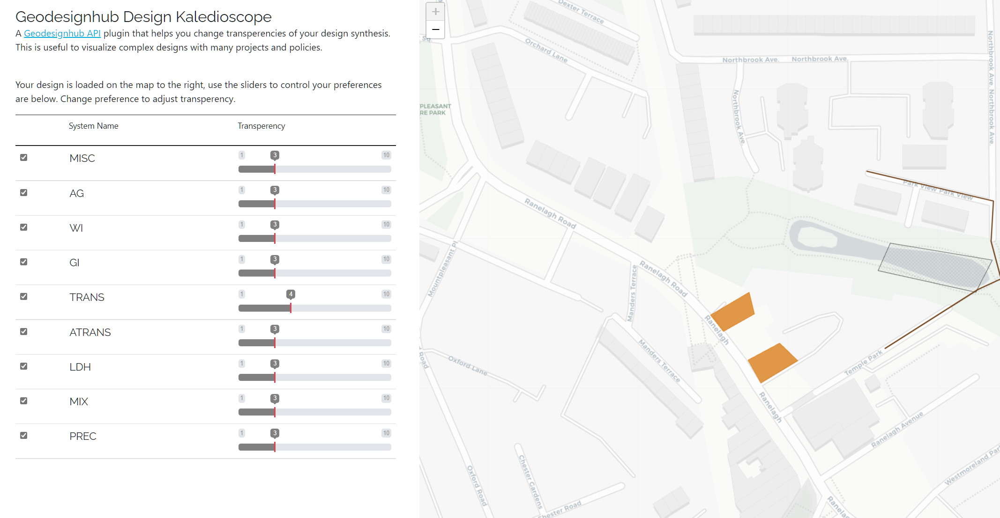

# Design Kaleidoscope

This is small plugin to help with visualizing a Geodesignhub Design synthesis. It uses the [Geodesignhub API](http://www.geodesignhub.com/api/). The tool downloads the design synthesis to vary transparency of the systems based on your preferences. It can be useful to understand how your priorities performs spatially and stimulate discussion in your team.

## Adding to your project

This plugin can be added to your project using the Administration panel or at the time of creating a project.

## Screenshot

